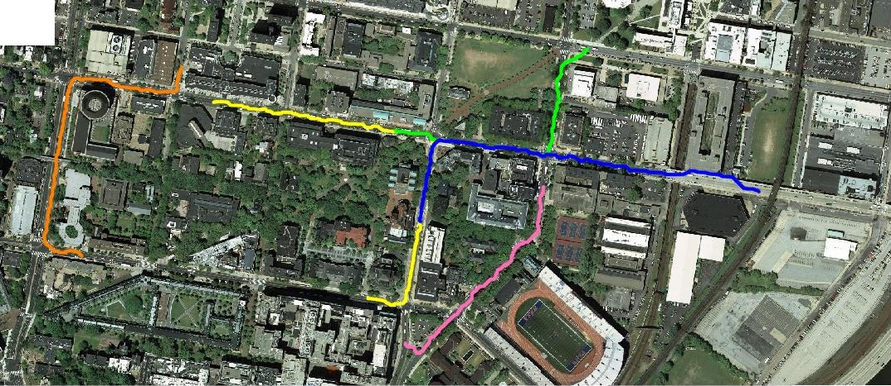

# Feasible Path Planning for Cars and Pedestrians using Imitation Learning

## Problem Statement
Given data from a LIDAR make a 2D map of the environment using particle filter. Also use the RGBD data to obtain a birds eye view of the texture and 3D map.

## Usage Guide:
1. Run `WrapperCar.m` for running Test Script for Car Planner.
2. Run `WrapperPedestrian.m` for running Test Script for Pedestrian Planner.
3. The training Codes for `Car` and `Pedestrian` are named `TrainCar.m` and `TrainPredestrian.m` respectively.
4.  The `.mat` file with CostMap for Car and Pedestrain are called `CarModel.mat` and `PedestrainModel.mat`.

Sample Outputs are places in the Outputs Folder with subfolders TestSet, TrainSet0, TrainSet1, TrainSet2 and TrainSet3.
Due to the robot's movement and kinect's bad calibration values the 3D-Point Cloud shouldn't be plotted for all samples (its also huge in size). So replace the second argument in the script
`Wrapper.m` line 78 to these values for the corresponding datasets.

TrainSet0: [1:2:170,210]
TrainSet3: [1:5:300,350:50:900]
TestSet  : [1:25:500,550:100:800,1050:10:1841]

## Report:
You can find the report [here](Report/ESE650Project5.pdf).

## Sample Outputs:
Pedestrian Paths:

Car Paths:

## References:
1. Ratliff, Nathan D., David Silver, and J. Andrew Bagnell. "Learning to search: Functional gradient techniques for imitation learning." Autonomous Robots 27.1 (2009): 25-53.
